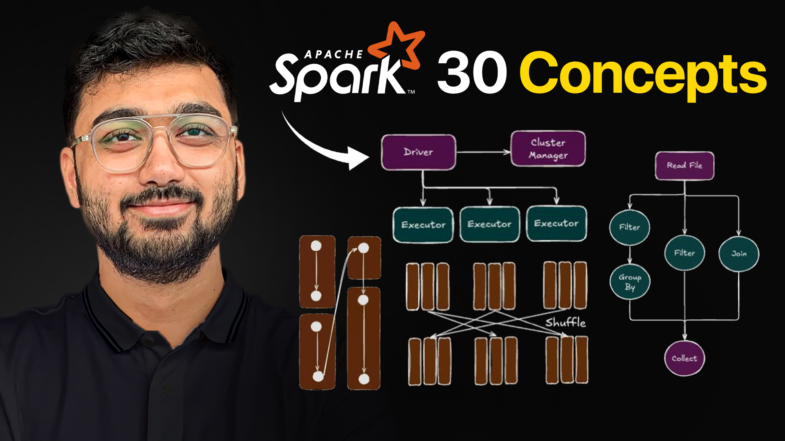

## Apache Spark 30 Concepts 

[YouTube Video Link: Apache Spark 30 Concepts](https://www.youtube.com/watch?v=z4Owc8RRApg)

This folder contains all diagrams used in the Miro board for explaining **30 most important concepts** of Apache Spark (as mentioned below):

1. DAG (Directed Acyclic Graph)
2. Cluster
3. Cluster Manager / Resource Manager
4. Application Master (AM)
5. Application Driver
6. PySpark Driver
7. Executors
8. Client Mode
9. Cluster Mode
10. Narrow Transformations
11. Lazy Operation
12. Wide Transformations
13. Actions
14. Shuffle
15. Unresolved Logic Plan
16. Logical Plan
17. Filter Pushdown
18. Projection Pushdown
19. Physical Plan
20. Catalyst Optimizer
21. Job
22. Stage
23. Task 
24. On Heap Memory
25. Execution Memory
26. Storage Memory
27. User Memory
28. Reserved Memory
29. Off Heap Memory
30. Overhead Memory
